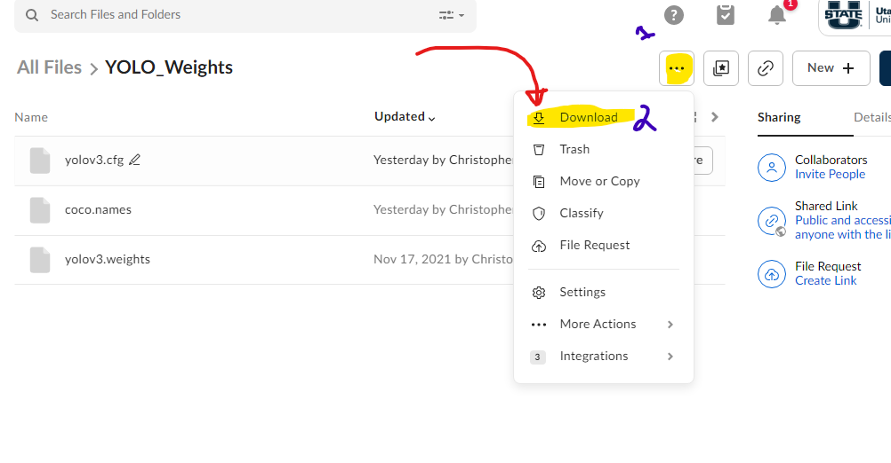

# AI_Image_Caption

## Description
This program will speak the caption of the image.

# Installation

## download YOLO
Go to this box and download the YOLO model directory and place it in the same directory as this file.
https://usu.box.com/s/hlzi8azhuhdwbiqw0kzu2bykppe5ql6d


This image shows you how to downloaded the YOLO model.



unzip the YOLO_Weights.zip file and place the weights in the same directory as this file. unzip the download into this the YOLO_Weights  folder.


this is what your directory structure should look something like:
```
C:.
│   clean_results.csv
│   coco_file.py
│   main.py
│   README.md
│   requirements.txt
│   results_out.csv
│   text_to_speach.py
│
├───assets
│       download_image.png
│
├───demo_images
│       2098418613.jpg
│       211402278.jpg
│       2123995873.jpg
│       2324749825.jpg
│       2330765551.jpg
│       2331827016.jpg
│       2403832405.jpg
│       2420549526.jpg
│       2629302765.jpg
│       284644694.jpg
│
├───YOLO_Weights
│       coco.names
│       yolov3.cfg
│       yolov3.weights
│
└───
```

----------------------------------------------------------------------------------------------------------------------
## PIP install the required packages

use pip to install the packages
all the required packages are in requirements.txt

simply run the following command

```
pip install -r requirements.txt
```
if on ubuntu:
```
sudo apt install espeak
```

# 🤷

For Windows, well this progrm will not work.

----------------------------------------------------------------------------------------------------------------------
# RUNNING THE PROGRAM
You can run the code by running the following command
```
python3 main.py
```

note I have a bug where the 1st image does not show up.also if you don't hear the speech turn on your speakers

# Results
The results are shown in the in the output csv file: results_out.csv. The first column is the image name and the second column is the conceptual dependency representation. the las 2 columns are the robot_caption and human_caption. 

Also note the CSV is delimited by a '|'. 

### Example Outpu from the csv file:
```
2331827016.jpg|{'person': ['ACTOR', ' is to the right of '], 'horse': ['ACTOR', ' is to the right of ']}| I see a person and a horse. I note that the person is to the right of the horse.| Rider riding horse as it jumps over a fence .
```

